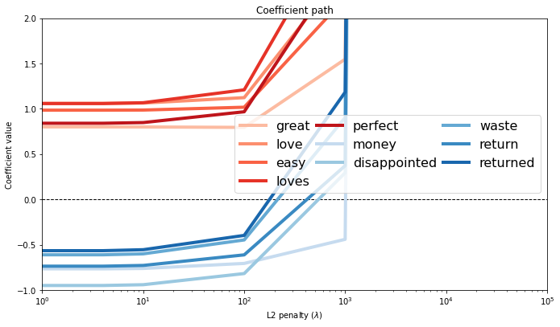
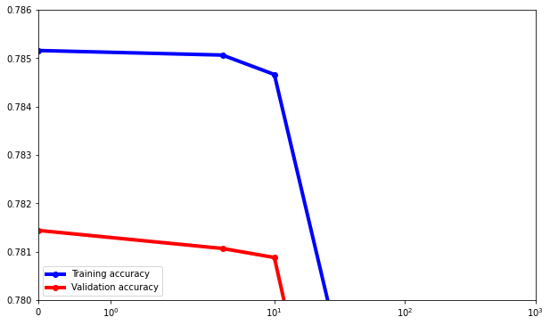

# Logistic Regression with L2 regularization

The goal of this second notebook is to implement your own logistic regression classifier with L2 regularization. You will do the following:

 * Extract features from Amazon product reviews.
 * Convert an SFrame into a NumPy array.
 * Write a function to compute the derivative of log likelihood function with an L2 penalty with respect to a single coefficient.
 * Implement gradient ascent with an L2 penalty.
 * Empirically explore how the L2 penalty can ameliorate overfitting.
 
# Fire up Turi Create
 
Make sure you have the latest version of Turi Create.


```python
from __future__ import division
import turicreate
```

## Load and process review dataset

For this assignment, we will use the same subset of the Amazon product review dataset that we used in Module 3 assignment. The subset was chosen to contain similar numbers of positive and negative reviews, as the original dataset consisted of mostly positive reviews.


```python
products = turicreate.SFrame('amazon_baby_subset.sframe/')
```

Just like we did previously, we will work with a hand-curated list of important words extracted from the review data. We will also perform 2 simple data transformations:

1. Remove punctuation using [Python's built-in](https://docs.python.org/2/library/string.html) string functionality.
2. Compute word counts (only for the **important_words**)

Refer to Module 3 assignment for more details.


```python
# The same feature processing (same as the previous assignments)
# ---------------------------------------------------------------
import json
with open('important_words.json', 'r') as f: # Reads the list of most frequent words
    important_words = json.load(f)
important_words = [str(s) for s in important_words]

import string 
def remove_punctuation(text):
    try: # python 2.x
        text = text.translate(None, string.punctuation) 
    except: # python 3.x
        translator = text.maketrans('', '', string.punctuation)
        text = text.translate(translator)
    return text

# Remove punctuation.
products['review_clean'] = products['review'].apply(remove_punctuation)

# Split out the words into individual columns
for word in important_words:
    products[word] = products['review_clean'].apply(lambda s : s.split().count(word))
```

Now, let us take a look at what the dataset looks like (**Note:** This may take a few minutes).


```python
products
```


<div style="max-height:1000px;max-width:1500px;overflow:auto;"><table frame="box" rules="cols">
    <tr>
        <th style="padding-left: 1em; padding-right: 1em; text-align: center">name</th>
        <th style="padding-left: 1em; padding-right: 1em; text-align: center">review</th>
        <th style="padding-left: 1em; padding-right: 1em; text-align: center">rating</th>
        <th style="padding-left: 1em; padding-right: 1em; text-align: center">sentiment</th>
        <th style="padding-left: 1em; padding-right: 1em; text-align: center">review_clean</th>
        <th style="padding-left: 1em; padding-right: 1em; text-align: center">baby</th>
    </tr>
    <tr>
        <td style="padding-left: 1em; padding-right: 1em; text-align: center; vertical-align: top">Stop Pacifier Sucking<br>without tears with ...</td>
        <td style="padding-left: 1em; padding-right: 1em; text-align: center; vertical-align: top">All of my kids have cried<br>non-stop when I tried to ...</td>
        <td style="padding-left: 1em; padding-right: 1em; text-align: center; vertical-align: top">5.0</td>
        <td style="padding-left: 1em; padding-right: 1em; text-align: center; vertical-align: top">1</td>
        <td style="padding-left: 1em; padding-right: 1em; text-align: center; vertical-align: top">All of my kids have cried<br>nonstop when I tried to ...</td>
        <td style="padding-left: 1em; padding-right: 1em; text-align: center; vertical-align: top">0</td>
    </tr>
    <tr>
        <td style="padding-left: 1em; padding-right: 1em; text-align: center; vertical-align: top">Nature&#x27;s Lullabies Second<br>Year Sticker Calendar ...</td>
        <td style="padding-left: 1em; padding-right: 1em; text-align: center; vertical-align: top">We wanted to get<br>something to keep track ...</td>
        <td style="padding-left: 1em; padding-right: 1em; text-align: center; vertical-align: top">5.0</td>
        <td style="padding-left: 1em; padding-right: 1em; text-align: center; vertical-align: top">1</td>
        <td style="padding-left: 1em; padding-right: 1em; text-align: center; vertical-align: top">We wanted to get<br>something to keep track ...</td>
        <td style="padding-left: 1em; padding-right: 1em; text-align: center; vertical-align: top">0</td>
    </tr>
    <tr>
        <td style="padding-left: 1em; padding-right: 1em; text-align: center; vertical-align: top">Nature&#x27;s Lullabies Second<br>Year Sticker Calendar ...</td>
        <td style="padding-left: 1em; padding-right: 1em; text-align: center; vertical-align: top">My daughter had her 1st<br>baby over a year ago. ...</td>
        <td style="padding-left: 1em; padding-right: 1em; text-align: center; vertical-align: top">5.0</td>
        <td style="padding-left: 1em; padding-right: 1em; text-align: center; vertical-align: top">1</td>
        <td style="padding-left: 1em; padding-right: 1em; text-align: center; vertical-align: top">My daughter had her 1st<br>baby over a year ago She ...</td>
        <td style="padding-left: 1em; padding-right: 1em; text-align: center; vertical-align: top">1</td>
    </tr>
    <tr>
        <td style="padding-left: 1em; padding-right: 1em; text-align: center; vertical-align: top">Lamaze Peekaboo, I Love<br>You ...</td>
        <td style="padding-left: 1em; padding-right: 1em; text-align: center; vertical-align: top">One of baby&#x27;s first and<br>favorite books, and i ...</td>
        <td style="padding-left: 1em; padding-right: 1em; text-align: center; vertical-align: top">4.0</td>
        <td style="padding-left: 1em; padding-right: 1em; text-align: center; vertical-align: top">1</td>
        <td style="padding-left: 1em; padding-right: 1em; text-align: center; vertical-align: top">One of babys first and<br>favorite books and it is ...</td>
        <td style="padding-left: 1em; padding-right: 1em; text-align: center; vertical-align: top">0</td>
    </tr>
    <tr>
        <td style="padding-left: 1em; padding-right: 1em; text-align: center; vertical-align: top">SoftPlay Peek-A-Boo<br>Where&#x27;s Elmo A Childr ...</td>
        <td style="padding-left: 1em; padding-right: 1em; text-align: center; vertical-align: top">Very cute interactive<br>book! My son loves this ...</td>
        <td style="padding-left: 1em; padding-right: 1em; text-align: center; vertical-align: top">5.0</td>
        <td style="padding-left: 1em; padding-right: 1em; text-align: center; vertical-align: top">1</td>
        <td style="padding-left: 1em; padding-right: 1em; text-align: center; vertical-align: top">Very cute interactive<br>book My son loves this ...</td>
        <td style="padding-left: 1em; padding-right: 1em; text-align: center; vertical-align: top">0</td>
    </tr>
    <tr>
        <td style="padding-left: 1em; padding-right: 1em; text-align: center; vertical-align: top">Our Baby Girl Memory Book</td>
        <td style="padding-left: 1em; padding-right: 1em; text-align: center; vertical-align: top">Beautiful book, I love it<br>to record cherished t ...</td>
        <td style="padding-left: 1em; padding-right: 1em; text-align: center; vertical-align: top">5.0</td>
        <td style="padding-left: 1em; padding-right: 1em; text-align: center; vertical-align: top">1</td>
        <td style="padding-left: 1em; padding-right: 1em; text-align: center; vertical-align: top">Beautiful book I love it<br>to record cherished t ...</td>
        <td style="padding-left: 1em; padding-right: 1em; text-align: center; vertical-align: top">0</td>
    </tr>
    <tr>
        <td style="padding-left: 1em; padding-right: 1em; text-align: center; vertical-align: top">Hunnt&amp;reg; Falling<br>Flowers and Birds Kids ...</td>
        <td style="padding-left: 1em; padding-right: 1em; text-align: center; vertical-align: top">Try this out for a spring<br>project !Easy ,fun and ...</td>
        <td style="padding-left: 1em; padding-right: 1em; text-align: center; vertical-align: top">5.0</td>
        <td style="padding-left: 1em; padding-right: 1em; text-align: center; vertical-align: top">1</td>
        <td style="padding-left: 1em; padding-right: 1em; text-align: center; vertical-align: top">Try this out for a spring<br>project Easy fun and ...</td>
        <td style="padding-left: 1em; padding-right: 1em; text-align: center; vertical-align: top">0</td>
    </tr>
    <tr>
        <td style="padding-left: 1em; padding-right: 1em; text-align: center; vertical-align: top">Blessed By Pope Benedict<br>XVI Divine Mercy Full ...</td>
        <td style="padding-left: 1em; padding-right: 1em; text-align: center; vertical-align: top">very nice Divine Mercy<br>Pendant of Jesus now on ...</td>
        <td style="padding-left: 1em; padding-right: 1em; text-align: center; vertical-align: top">5.0</td>
        <td style="padding-left: 1em; padding-right: 1em; text-align: center; vertical-align: top">1</td>
        <td style="padding-left: 1em; padding-right: 1em; text-align: center; vertical-align: top">very nice Divine Mercy<br>Pendant of Jesus now on ...</td>
        <td style="padding-left: 1em; padding-right: 1em; text-align: center; vertical-align: top">0</td>
    </tr>
    <tr>
        <td style="padding-left: 1em; padding-right: 1em; text-align: center; vertical-align: top">Cloth Diaper Pins<br>Stainless Steel ...</td>
        <td style="padding-left: 1em; padding-right: 1em; text-align: center; vertical-align: top">We bought the pins as my<br>6 year old Autistic son ...</td>
        <td style="padding-left: 1em; padding-right: 1em; text-align: center; vertical-align: top">4.0</td>
        <td style="padding-left: 1em; padding-right: 1em; text-align: center; vertical-align: top">1</td>
        <td style="padding-left: 1em; padding-right: 1em; text-align: center; vertical-align: top">We bought the pins as my<br>6 year old Autistic son ...</td>
        <td style="padding-left: 1em; padding-right: 1em; text-align: center; vertical-align: top">0</td>
    </tr>
    <tr>
        <td style="padding-left: 1em; padding-right: 1em; text-align: center; vertical-align: top">Cloth Diaper Pins<br>Stainless Steel ...</td>
        <td style="padding-left: 1em; padding-right: 1em; text-align: center; vertical-align: top">It has been many years<br>since we needed diaper ...</td>
        <td style="padding-left: 1em; padding-right: 1em; text-align: center; vertical-align: top">5.0</td>
        <td style="padding-left: 1em; padding-right: 1em; text-align: center; vertical-align: top">1</td>
        <td style="padding-left: 1em; padding-right: 1em; text-align: center; vertical-align: top">It has been many years<br>since we needed diaper ...</td>
        <td style="padding-left: 1em; padding-right: 1em; text-align: center; vertical-align: top">0</td>
    </tr>
</table>
<table frame="box" rules="cols">
    <tr>
        <th style="padding-left: 1em; padding-right: 1em; text-align: center">one</th>
        <th style="padding-left: 1em; padding-right: 1em; text-align: center">great</th>
        <th style="padding-left: 1em; padding-right: 1em; text-align: center">love</th>
        <th style="padding-left: 1em; padding-right: 1em; text-align: center">use</th>
        <th style="padding-left: 1em; padding-right: 1em; text-align: center">would</th>
        <th style="padding-left: 1em; padding-right: 1em; text-align: center">like</th>
        <th style="padding-left: 1em; padding-right: 1em; text-align: center">easy</th>
        <th style="padding-left: 1em; padding-right: 1em; text-align: center">little</th>
        <th style="padding-left: 1em; padding-right: 1em; text-align: center">seat</th>
        <th style="padding-left: 1em; padding-right: 1em; text-align: center">old</th>
        <th style="padding-left: 1em; padding-right: 1em; text-align: center">well</th>
        <th style="padding-left: 1em; padding-right: 1em; text-align: center">get</th>
        <th style="padding-left: 1em; padding-right: 1em; text-align: center">also</th>
        <th style="padding-left: 1em; padding-right: 1em; text-align: center">really</th>
        <th style="padding-left: 1em; padding-right: 1em; text-align: center">son</th>
        <th style="padding-left: 1em; padding-right: 1em; text-align: center">time</th>
        <th style="padding-left: 1em; padding-right: 1em; text-align: center">bought</th>
    </tr>
    <tr>
        <td style="padding-left: 1em; padding-right: 1em; text-align: center; vertical-align: top">0</td>
        <td style="padding-left: 1em; padding-right: 1em; text-align: center; vertical-align: top">1</td>
        <td style="padding-left: 1em; padding-right: 1em; text-align: center; vertical-align: top">0</td>
        <td style="padding-left: 1em; padding-right: 1em; text-align: center; vertical-align: top">0</td>
        <td style="padding-left: 1em; padding-right: 1em; text-align: center; vertical-align: top">0</td>
        <td style="padding-left: 1em; padding-right: 1em; text-align: center; vertical-align: top">0</td>
        <td style="padding-left: 1em; padding-right: 1em; text-align: center; vertical-align: top">1</td>
        <td style="padding-left: 1em; padding-right: 1em; text-align: center; vertical-align: top">0</td>
        <td style="padding-left: 1em; padding-right: 1em; text-align: center; vertical-align: top">0</td>
        <td style="padding-left: 1em; padding-right: 1em; text-align: center; vertical-align: top">0</td>
        <td style="padding-left: 1em; padding-right: 1em; text-align: center; vertical-align: top">0</td>
        <td style="padding-left: 1em; padding-right: 1em; text-align: center; vertical-align: top">0</td>
        <td style="padding-left: 1em; padding-right: 1em; text-align: center; vertical-align: top">0</td>
        <td style="padding-left: 1em; padding-right: 1em; text-align: center; vertical-align: top">0</td>
        <td style="padding-left: 1em; padding-right: 1em; text-align: center; vertical-align: top">0</td>
        <td style="padding-left: 1em; padding-right: 1em; text-align: center; vertical-align: top">0</td>
        <td style="padding-left: 1em; padding-right: 1em; text-align: center; vertical-align: top">0</td>
    </tr>
    <tr>
        <td style="padding-left: 1em; padding-right: 1em; text-align: center; vertical-align: top">0</td>
        <td style="padding-left: 1em; padding-right: 1em; text-align: center; vertical-align: top">0</td>
        <td style="padding-left: 1em; padding-right: 1em; text-align: center; vertical-align: top">0</td>
        <td style="padding-left: 1em; padding-right: 1em; text-align: center; vertical-align: top">0</td>
        <td style="padding-left: 1em; padding-right: 1em; text-align: center; vertical-align: top">0</td>
        <td style="padding-left: 1em; padding-right: 1em; text-align: center; vertical-align: top">0</td>
        <td style="padding-left: 1em; padding-right: 1em; text-align: center; vertical-align: top">0</td>
        <td style="padding-left: 1em; padding-right: 1em; text-align: center; vertical-align: top">0</td>
        <td style="padding-left: 1em; padding-right: 1em; text-align: center; vertical-align: top">0</td>
        <td style="padding-left: 1em; padding-right: 1em; text-align: center; vertical-align: top">0</td>
        <td style="padding-left: 1em; padding-right: 1em; text-align: center; vertical-align: top">0</td>
        <td style="padding-left: 1em; padding-right: 1em; text-align: center; vertical-align: top">1</td>
        <td style="padding-left: 1em; padding-right: 1em; text-align: center; vertical-align: top">0</td>
        <td style="padding-left: 1em; padding-right: 1em; text-align: center; vertical-align: top">0</td>
        <td style="padding-left: 1em; padding-right: 1em; text-align: center; vertical-align: top">0</td>
        <td style="padding-left: 1em; padding-right: 1em; text-align: center; vertical-align: top">0</td>
        <td style="padding-left: 1em; padding-right: 1em; text-align: center; vertical-align: top">0</td>
    </tr>
    <tr>
        <td style="padding-left: 1em; padding-right: 1em; text-align: center; vertical-align: top">0</td>
        <td style="padding-left: 1em; padding-right: 1em; text-align: center; vertical-align: top">0</td>
        <td style="padding-left: 1em; padding-right: 1em; text-align: center; vertical-align: top">0</td>
        <td style="padding-left: 1em; padding-right: 1em; text-align: center; vertical-align: top">0</td>
        <td style="padding-left: 1em; padding-right: 1em; text-align: center; vertical-align: top">0</td>
        <td style="padding-left: 1em; padding-right: 1em; text-align: center; vertical-align: top">0</td>
        <td style="padding-left: 1em; padding-right: 1em; text-align: center; vertical-align: top">0</td>
        <td style="padding-left: 1em; padding-right: 1em; text-align: center; vertical-align: top">0</td>
        <td style="padding-left: 1em; padding-right: 1em; text-align: center; vertical-align: top">0</td>
        <td style="padding-left: 1em; padding-right: 1em; text-align: center; vertical-align: top">1</td>
        <td style="padding-left: 1em; padding-right: 1em; text-align: center; vertical-align: top">0</td>
        <td style="padding-left: 1em; padding-right: 1em; text-align: center; vertical-align: top">1</td>
        <td style="padding-left: 1em; padding-right: 1em; text-align: center; vertical-align: top">0</td>
        <td style="padding-left: 1em; padding-right: 1em; text-align: center; vertical-align: top">0</td>
        <td style="padding-left: 1em; padding-right: 1em; text-align: center; vertical-align: top">1</td>
        <td style="padding-left: 1em; padding-right: 1em; text-align: center; vertical-align: top">0</td>
        <td style="padding-left: 1em; padding-right: 1em; text-align: center; vertical-align: top">0</td>
    </tr>
    <tr>
        <td style="padding-left: 1em; padding-right: 1em; text-align: center; vertical-align: top">0</td>
        <td style="padding-left: 1em; padding-right: 1em; text-align: center; vertical-align: top">0</td>
        <td style="padding-left: 1em; padding-right: 1em; text-align: center; vertical-align: top">0</td>
        <td style="padding-left: 1em; padding-right: 1em; text-align: center; vertical-align: top">0</td>
        <td style="padding-left: 1em; padding-right: 1em; text-align: center; vertical-align: top">0</td>
        <td style="padding-left: 1em; padding-right: 1em; text-align: center; vertical-align: top">1</td>
        <td style="padding-left: 1em; padding-right: 1em; text-align: center; vertical-align: top">0</td>
        <td style="padding-left: 1em; padding-right: 1em; text-align: center; vertical-align: top">0</td>
        <td style="padding-left: 1em; padding-right: 1em; text-align: center; vertical-align: top">0</td>
        <td style="padding-left: 1em; padding-right: 1em; text-align: center; vertical-align: top">0</td>
        <td style="padding-left: 1em; padding-right: 1em; text-align: center; vertical-align: top">0</td>
        <td style="padding-left: 1em; padding-right: 1em; text-align: center; vertical-align: top">0</td>
        <td style="padding-left: 1em; padding-right: 1em; text-align: center; vertical-align: top">0</td>
        <td style="padding-left: 1em; padding-right: 1em; text-align: center; vertical-align: top">0</td>
        <td style="padding-left: 1em; padding-right: 1em; text-align: center; vertical-align: top">0</td>
        <td style="padding-left: 1em; padding-right: 1em; text-align: center; vertical-align: top">0</td>
        <td style="padding-left: 1em; padding-right: 1em; text-align: center; vertical-align: top">0</td>
    </tr>
    <tr>
        <td style="padding-left: 1em; padding-right: 1em; text-align: center; vertical-align: top">0</td>
        <td style="padding-left: 1em; padding-right: 1em; text-align: center; vertical-align: top">1</td>
        <td style="padding-left: 1em; padding-right: 1em; text-align: center; vertical-align: top">0</td>
        <td style="padding-left: 1em; padding-right: 1em; text-align: center; vertical-align: top">0</td>
        <td style="padding-left: 1em; padding-right: 1em; text-align: center; vertical-align: top">0</td>
        <td style="padding-left: 1em; padding-right: 1em; text-align: center; vertical-align: top">0</td>
        <td style="padding-left: 1em; padding-right: 1em; text-align: center; vertical-align: top">0</td>
        <td style="padding-left: 1em; padding-right: 1em; text-align: center; vertical-align: top">0</td>
        <td style="padding-left: 1em; padding-right: 1em; text-align: center; vertical-align: top">0</td>
        <td style="padding-left: 1em; padding-right: 1em; text-align: center; vertical-align: top">0</td>
        <td style="padding-left: 1em; padding-right: 1em; text-align: center; vertical-align: top">0</td>
        <td style="padding-left: 1em; padding-right: 1em; text-align: center; vertical-align: top">0</td>
        <td style="padding-left: 1em; padding-right: 1em; text-align: center; vertical-align: top">0</td>
        <td style="padding-left: 1em; padding-right: 1em; text-align: center; vertical-align: top">0</td>
        <td style="padding-left: 1em; padding-right: 1em; text-align: center; vertical-align: top">1</td>
        <td style="padding-left: 1em; padding-right: 1em; text-align: center; vertical-align: top">0</td>
        <td style="padding-left: 1em; padding-right: 1em; text-align: center; vertical-align: top">0</td>
    </tr>
    <tr>
        <td style="padding-left: 1em; padding-right: 1em; text-align: center; vertical-align: top">0</td>
        <td style="padding-left: 1em; padding-right: 1em; text-align: center; vertical-align: top">1</td>
        <td style="padding-left: 1em; padding-right: 1em; text-align: center; vertical-align: top">1</td>
        <td style="padding-left: 1em; padding-right: 1em; text-align: center; vertical-align: top">0</td>
        <td style="padding-left: 1em; padding-right: 1em; text-align: center; vertical-align: top">0</td>
        <td style="padding-left: 1em; padding-right: 1em; text-align: center; vertical-align: top">0</td>
        <td style="padding-left: 1em; padding-right: 1em; text-align: center; vertical-align: top">0</td>
        <td style="padding-left: 1em; padding-right: 1em; text-align: center; vertical-align: top">0</td>
        <td style="padding-left: 1em; padding-right: 1em; text-align: center; vertical-align: top">0</td>
        <td style="padding-left: 1em; padding-right: 1em; text-align: center; vertical-align: top">0</td>
        <td style="padding-left: 1em; padding-right: 1em; text-align: center; vertical-align: top">0</td>
        <td style="padding-left: 1em; padding-right: 1em; text-align: center; vertical-align: top">0</td>
        <td style="padding-left: 1em; padding-right: 1em; text-align: center; vertical-align: top">0</td>
        <td style="padding-left: 1em; padding-right: 1em; text-align: center; vertical-align: top">0</td>
        <td style="padding-left: 1em; padding-right: 1em; text-align: center; vertical-align: top">0</td>
        <td style="padding-left: 1em; padding-right: 1em; text-align: center; vertical-align: top">0</td>
        <td style="padding-left: 1em; padding-right: 1em; text-align: center; vertical-align: top">0</td>
    </tr>
    <tr>
        <td style="padding-left: 1em; padding-right: 1em; text-align: center; vertical-align: top">0</td>
        <td style="padding-left: 1em; padding-right: 1em; text-align: center; vertical-align: top">0</td>
        <td style="padding-left: 1em; padding-right: 1em; text-align: center; vertical-align: top">0</td>
        <td style="padding-left: 1em; padding-right: 1em; text-align: center; vertical-align: top">0</td>
        <td style="padding-left: 1em; padding-right: 1em; text-align: center; vertical-align: top">0</td>
        <td style="padding-left: 1em; padding-right: 1em; text-align: center; vertical-align: top">0</td>
        <td style="padding-left: 1em; padding-right: 1em; text-align: center; vertical-align: top">0</td>
        <td style="padding-left: 1em; padding-right: 1em; text-align: center; vertical-align: top">0</td>
        <td style="padding-left: 1em; padding-right: 1em; text-align: center; vertical-align: top">0</td>
        <td style="padding-left: 1em; padding-right: 1em; text-align: center; vertical-align: top">0</td>
        <td style="padding-left: 1em; padding-right: 1em; text-align: center; vertical-align: top">0</td>
        <td style="padding-left: 1em; padding-right: 1em; text-align: center; vertical-align: top">0</td>
        <td style="padding-left: 1em; padding-right: 1em; text-align: center; vertical-align: top">0</td>
        <td style="padding-left: 1em; padding-right: 1em; text-align: center; vertical-align: top">0</td>
        <td style="padding-left: 1em; padding-right: 1em; text-align: center; vertical-align: top">0</td>
        <td style="padding-left: 1em; padding-right: 1em; text-align: center; vertical-align: top">0</td>
        <td style="padding-left: 1em; padding-right: 1em; text-align: center; vertical-align: top">0</td>
    </tr>
    <tr>
        <td style="padding-left: 1em; padding-right: 1em; text-align: center; vertical-align: top">0</td>
        <td style="padding-left: 1em; padding-right: 1em; text-align: center; vertical-align: top">0</td>
        <td style="padding-left: 1em; padding-right: 1em; text-align: center; vertical-align: top">0</td>
        <td style="padding-left: 1em; padding-right: 1em; text-align: center; vertical-align: top">0</td>
        <td style="padding-left: 1em; padding-right: 1em; text-align: center; vertical-align: top">0</td>
        <td style="padding-left: 1em; padding-right: 1em; text-align: center; vertical-align: top">0</td>
        <td style="padding-left: 1em; padding-right: 1em; text-align: center; vertical-align: top">0</td>
        <td style="padding-left: 1em; padding-right: 1em; text-align: center; vertical-align: top">0</td>
        <td style="padding-left: 1em; padding-right: 1em; text-align: center; vertical-align: top">0</td>
        <td style="padding-left: 1em; padding-right: 1em; text-align: center; vertical-align: top">0</td>
        <td style="padding-left: 1em; padding-right: 1em; text-align: center; vertical-align: top">0</td>
        <td style="padding-left: 1em; padding-right: 1em; text-align: center; vertical-align: top">0</td>
        <td style="padding-left: 1em; padding-right: 1em; text-align: center; vertical-align: top">0</td>
        <td style="padding-left: 1em; padding-right: 1em; text-align: center; vertical-align: top">0</td>
        <td style="padding-left: 1em; padding-right: 1em; text-align: center; vertical-align: top">0</td>
        <td style="padding-left: 1em; padding-right: 1em; text-align: center; vertical-align: top">0</td>
        <td style="padding-left: 1em; padding-right: 1em; text-align: center; vertical-align: top">0</td>
    </tr>
    <tr>
        <td style="padding-left: 1em; padding-right: 1em; text-align: center; vertical-align: top">1</td>
        <td style="padding-left: 1em; padding-right: 1em; text-align: center; vertical-align: top">0</td>
        <td style="padding-left: 1em; padding-right: 1em; text-align: center; vertical-align: top">0</td>
        <td style="padding-left: 1em; padding-right: 1em; text-align: center; vertical-align: top">1</td>
        <td style="padding-left: 1em; padding-right: 1em; text-align: center; vertical-align: top">0</td>
        <td style="padding-left: 1em; padding-right: 1em; text-align: center; vertical-align: top">0</td>
        <td style="padding-left: 1em; padding-right: 1em; text-align: center; vertical-align: top">0</td>
        <td style="padding-left: 1em; padding-right: 1em; text-align: center; vertical-align: top">0</td>
        <td style="padding-left: 1em; padding-right: 1em; text-align: center; vertical-align: top">0</td>
        <td style="padding-left: 1em; padding-right: 1em; text-align: center; vertical-align: top">1</td>
        <td style="padding-left: 1em; padding-right: 1em; text-align: center; vertical-align: top">0</td>
        <td style="padding-left: 1em; padding-right: 1em; text-align: center; vertical-align: top">0</td>
        <td style="padding-left: 1em; padding-right: 1em; text-align: center; vertical-align: top">0</td>
        <td style="padding-left: 1em; padding-right: 1em; text-align: center; vertical-align: top">0</td>
        <td style="padding-left: 1em; padding-right: 1em; text-align: center; vertical-align: top">1</td>
        <td style="padding-left: 1em; padding-right: 1em; text-align: center; vertical-align: top">1</td>
        <td style="padding-left: 1em; padding-right: 1em; text-align: center; vertical-align: top">1</td>
    </tr>
    <tr>
        <td style="padding-left: 1em; padding-right: 1em; text-align: center; vertical-align: top">1</td>
        <td style="padding-left: 1em; padding-right: 1em; text-align: center; vertical-align: top">0</td>
        <td style="padding-left: 1em; padding-right: 1em; text-align: center; vertical-align: top">0</td>
        <td style="padding-left: 1em; padding-right: 1em; text-align: center; vertical-align: top">0</td>
        <td style="padding-left: 1em; padding-right: 1em; text-align: center; vertical-align: top">0</td>
        <td style="padding-left: 1em; padding-right: 1em; text-align: center; vertical-align: top">1</td>
        <td style="padding-left: 1em; padding-right: 1em; text-align: center; vertical-align: top">0</td>
        <td style="padding-left: 1em; padding-right: 1em; text-align: center; vertical-align: top">1</td>
        <td style="padding-left: 1em; padding-right: 1em; text-align: center; vertical-align: top">0</td>
        <td style="padding-left: 1em; padding-right: 1em; text-align: center; vertical-align: top">0</td>
        <td style="padding-left: 1em; padding-right: 1em; text-align: center; vertical-align: top">0</td>
        <td style="padding-left: 1em; padding-right: 1em; text-align: center; vertical-align: top">1</td>
        <td style="padding-left: 1em; padding-right: 1em; text-align: center; vertical-align: top">0</td>
        <td style="padding-left: 1em; padding-right: 1em; text-align: center; vertical-align: top">0</td>
        <td style="padding-left: 1em; padding-right: 1em; text-align: center; vertical-align: top">0</td>
        <td style="padding-left: 1em; padding-right: 1em; text-align: center; vertical-align: top">0</td>
        <td style="padding-left: 1em; padding-right: 1em; text-align: center; vertical-align: top">0</td>
    </tr>
</table>
<table frame="box" rules="cols">
    <tr>
        <th style="padding-left: 1em; padding-right: 1em; text-align: center">product</th>
        <th style="padding-left: 1em; padding-right: 1em; text-align: center">good</th>
        <th style="padding-left: 1em; padding-right: 1em; text-align: center">daughter</th>
        <th style="padding-left: 1em; padding-right: 1em; text-align: center">much</th>
        <th style="padding-left: 1em; padding-right: 1em; text-align: center">loves</th>
        <th style="padding-left: 1em; padding-right: 1em; text-align: center">stroller</th>
        <th style="padding-left: 1em; padding-right: 1em; text-align: center">put</th>
        <th style="padding-left: 1em; padding-right: 1em; text-align: center">months</th>
        <th style="padding-left: 1em; padding-right: 1em; text-align: center">car</th>
        <th style="padding-left: 1em; padding-right: 1em; text-align: center">still</th>
        <th style="padding-left: 1em; padding-right: 1em; text-align: center">back</th>
        <th style="padding-left: 1em; padding-right: 1em; text-align: center">used</th>
        <th style="padding-left: 1em; padding-right: 1em; text-align: center">recommend</th>
        <th style="padding-left: 1em; padding-right: 1em; text-align: center">first</th>
        <th style="padding-left: 1em; padding-right: 1em; text-align: center">even</th>
    </tr>
    <tr>
        <td style="padding-left: 1em; padding-right: 1em; text-align: center; vertical-align: top">0</td>
        <td style="padding-left: 1em; padding-right: 1em; text-align: center; vertical-align: top">0</td>
        <td style="padding-left: 1em; padding-right: 1em; text-align: center; vertical-align: top">0</td>
        <td style="padding-left: 1em; padding-right: 1em; text-align: center; vertical-align: top">0</td>
        <td style="padding-left: 1em; padding-right: 1em; text-align: center; vertical-align: top">0</td>
        <td style="padding-left: 1em; padding-right: 1em; text-align: center; vertical-align: top">0</td>
        <td style="padding-left: 1em; padding-right: 1em; text-align: center; vertical-align: top">0</td>
        <td style="padding-left: 1em; padding-right: 1em; text-align: center; vertical-align: top">0</td>
        <td style="padding-left: 1em; padding-right: 1em; text-align: center; vertical-align: top">0</td>
        <td style="padding-left: 1em; padding-right: 1em; text-align: center; vertical-align: top">0</td>
        <td style="padding-left: 1em; padding-right: 1em; text-align: center; vertical-align: top">0</td>
        <td style="padding-left: 1em; padding-right: 1em; text-align: center; vertical-align: top">0</td>
        <td style="padding-left: 1em; padding-right: 1em; text-align: center; vertical-align: top">0</td>
        <td style="padding-left: 1em; padding-right: 1em; text-align: center; vertical-align: top">0</td>
        <td style="padding-left: 1em; padding-right: 1em; text-align: center; vertical-align: top">0</td>
    </tr>
    <tr>
        <td style="padding-left: 1em; padding-right: 1em; text-align: center; vertical-align: top">0</td>
        <td style="padding-left: 1em; padding-right: 1em; text-align: center; vertical-align: top">0</td>
        <td style="padding-left: 1em; padding-right: 1em; text-align: center; vertical-align: top">0</td>
        <td style="padding-left: 1em; padding-right: 1em; text-align: center; vertical-align: top">0</td>
        <td style="padding-left: 1em; padding-right: 1em; text-align: center; vertical-align: top">0</td>
        <td style="padding-left: 1em; padding-right: 1em; text-align: center; vertical-align: top">0</td>
        <td style="padding-left: 1em; padding-right: 1em; text-align: center; vertical-align: top">0</td>
        <td style="padding-left: 1em; padding-right: 1em; text-align: center; vertical-align: top">0</td>
        <td style="padding-left: 1em; padding-right: 1em; text-align: center; vertical-align: top">0</td>
        <td style="padding-left: 1em; padding-right: 1em; text-align: center; vertical-align: top">0</td>
        <td style="padding-left: 1em; padding-right: 1em; text-align: center; vertical-align: top">0</td>
        <td style="padding-left: 1em; padding-right: 1em; text-align: center; vertical-align: top">0</td>
        <td style="padding-left: 1em; padding-right: 1em; text-align: center; vertical-align: top">0</td>
        <td style="padding-left: 1em; padding-right: 1em; text-align: center; vertical-align: top">0</td>
        <td style="padding-left: 1em; padding-right: 1em; text-align: center; vertical-align: top">0</td>
    </tr>
    <tr>
        <td style="padding-left: 1em; padding-right: 1em; text-align: center; vertical-align: top">0</td>
        <td style="padding-left: 1em; padding-right: 1em; text-align: center; vertical-align: top">0</td>
        <td style="padding-left: 1em; padding-right: 1em; text-align: center; vertical-align: top">1</td>
        <td style="padding-left: 1em; padding-right: 1em; text-align: center; vertical-align: top">0</td>
        <td style="padding-left: 1em; padding-right: 1em; text-align: center; vertical-align: top">0</td>
        <td style="padding-left: 1em; padding-right: 1em; text-align: center; vertical-align: top">0</td>
        <td style="padding-left: 1em; padding-right: 1em; text-align: center; vertical-align: top">0</td>
        <td style="padding-left: 1em; padding-right: 1em; text-align: center; vertical-align: top">0</td>
        <td style="padding-left: 1em; padding-right: 1em; text-align: center; vertical-align: top">0</td>
        <td style="padding-left: 1em; padding-right: 1em; text-align: center; vertical-align: top">0</td>
        <td style="padding-left: 1em; padding-right: 1em; text-align: center; vertical-align: top">0</td>
        <td style="padding-left: 1em; padding-right: 1em; text-align: center; vertical-align: top">0</td>
        <td style="padding-left: 1em; padding-right: 1em; text-align: center; vertical-align: top">0</td>
        <td style="padding-left: 1em; padding-right: 1em; text-align: center; vertical-align: top">1</td>
        <td style="padding-left: 1em; padding-right: 1em; text-align: center; vertical-align: top">0</td>
    </tr>
    <tr>
        <td style="padding-left: 1em; padding-right: 1em; text-align: center; vertical-align: top">0</td>
        <td style="padding-left: 1em; padding-right: 1em; text-align: center; vertical-align: top">0</td>
        <td style="padding-left: 1em; padding-right: 1em; text-align: center; vertical-align: top">0</td>
        <td style="padding-left: 1em; padding-right: 1em; text-align: center; vertical-align: top">0</td>
        <td style="padding-left: 1em; padding-right: 1em; text-align: center; vertical-align: top">0</td>
        <td style="padding-left: 1em; padding-right: 1em; text-align: center; vertical-align: top">0</td>
        <td style="padding-left: 1em; padding-right: 1em; text-align: center; vertical-align: top">0</td>
        <td style="padding-left: 1em; padding-right: 1em; text-align: center; vertical-align: top">0</td>
        <td style="padding-left: 1em; padding-right: 1em; text-align: center; vertical-align: top">0</td>
        <td style="padding-left: 1em; padding-right: 1em; text-align: center; vertical-align: top">0</td>
        <td style="padding-left: 1em; padding-right: 1em; text-align: center; vertical-align: top">0</td>
        <td style="padding-left: 1em; padding-right: 1em; text-align: center; vertical-align: top">0</td>
        <td style="padding-left: 1em; padding-right: 1em; text-align: center; vertical-align: top">0</td>
        <td style="padding-left: 1em; padding-right: 1em; text-align: center; vertical-align: top">1</td>
        <td style="padding-left: 1em; padding-right: 1em; text-align: center; vertical-align: top">0</td>
    </tr>
    <tr>
        <td style="padding-left: 1em; padding-right: 1em; text-align: center; vertical-align: top">0</td>
        <td style="padding-left: 1em; padding-right: 1em; text-align: center; vertical-align: top">0</td>
        <td style="padding-left: 1em; padding-right: 1em; text-align: center; vertical-align: top">0</td>
        <td style="padding-left: 1em; padding-right: 1em; text-align: center; vertical-align: top">0</td>
        <td style="padding-left: 1em; padding-right: 1em; text-align: center; vertical-align: top">1</td>
        <td style="padding-left: 1em; padding-right: 1em; text-align: center; vertical-align: top">0</td>
        <td style="padding-left: 1em; padding-right: 1em; text-align: center; vertical-align: top">0</td>
        <td style="padding-left: 1em; padding-right: 1em; text-align: center; vertical-align: top">0</td>
        <td style="padding-left: 1em; padding-right: 1em; text-align: center; vertical-align: top">0</td>
        <td style="padding-left: 1em; padding-right: 1em; text-align: center; vertical-align: top">0</td>
        <td style="padding-left: 1em; padding-right: 1em; text-align: center; vertical-align: top">0</td>
        <td style="padding-left: 1em; padding-right: 1em; text-align: center; vertical-align: top">0</td>
        <td style="padding-left: 1em; padding-right: 1em; text-align: center; vertical-align: top">0</td>
        <td style="padding-left: 1em; padding-right: 1em; text-align: center; vertical-align: top">0</td>
        <td style="padding-left: 1em; padding-right: 1em; text-align: center; vertical-align: top">0</td>
    </tr>
    <tr>
        <td style="padding-left: 1em; padding-right: 1em; text-align: center; vertical-align: top">0</td>
        <td style="padding-left: 1em; padding-right: 1em; text-align: center; vertical-align: top">0</td>
        <td style="padding-left: 1em; padding-right: 1em; text-align: center; vertical-align: top">0</td>
        <td style="padding-left: 1em; padding-right: 1em; text-align: center; vertical-align: top">0</td>
        <td style="padding-left: 1em; padding-right: 1em; text-align: center; vertical-align: top">0</td>
        <td style="padding-left: 1em; padding-right: 1em; text-align: center; vertical-align: top">0</td>
        <td style="padding-left: 1em; padding-right: 1em; text-align: center; vertical-align: top">0</td>
        <td style="padding-left: 1em; padding-right: 1em; text-align: center; vertical-align: top">0</td>
        <td style="padding-left: 1em; padding-right: 1em; text-align: center; vertical-align: top">0</td>
        <td style="padding-left: 1em; padding-right: 1em; text-align: center; vertical-align: top">0</td>
        <td style="padding-left: 1em; padding-right: 1em; text-align: center; vertical-align: top">0</td>
        <td style="padding-left: 1em; padding-right: 1em; text-align: center; vertical-align: top">0</td>
        <td style="padding-left: 1em; padding-right: 1em; text-align: center; vertical-align: top">0</td>
        <td style="padding-left: 1em; padding-right: 1em; text-align: center; vertical-align: top">0</td>
        <td style="padding-left: 1em; padding-right: 1em; text-align: center; vertical-align: top">0</td>
    </tr>
    <tr>
        <td style="padding-left: 1em; padding-right: 1em; text-align: center; vertical-align: top">0</td>
        <td style="padding-left: 1em; padding-right: 1em; text-align: center; vertical-align: top">0</td>
        <td style="padding-left: 1em; padding-right: 1em; text-align: center; vertical-align: top">0</td>
        <td style="padding-left: 1em; padding-right: 1em; text-align: center; vertical-align: top">0</td>
        <td style="padding-left: 1em; padding-right: 1em; text-align: center; vertical-align: top">0</td>
        <td style="padding-left: 1em; padding-right: 1em; text-align: center; vertical-align: top">0</td>
        <td style="padding-left: 1em; padding-right: 1em; text-align: center; vertical-align: top">0</td>
        <td style="padding-left: 1em; padding-right: 1em; text-align: center; vertical-align: top">0</td>
        <td style="padding-left: 1em; padding-right: 1em; text-align: center; vertical-align: top">0</td>
        <td style="padding-left: 1em; padding-right: 1em; text-align: center; vertical-align: top">0</td>
        <td style="padding-left: 1em; padding-right: 1em; text-align: center; vertical-align: top">0</td>
        <td style="padding-left: 1em; padding-right: 1em; text-align: center; vertical-align: top">0</td>
        <td style="padding-left: 1em; padding-right: 1em; text-align: center; vertical-align: top">0</td>
        <td style="padding-left: 1em; padding-right: 1em; text-align: center; vertical-align: top">0</td>
        <td style="padding-left: 1em; padding-right: 1em; text-align: center; vertical-align: top">0</td>
    </tr>
    <tr>
        <td style="padding-left: 1em; padding-right: 1em; text-align: center; vertical-align: top">0</td>
        <td style="padding-left: 1em; padding-right: 1em; text-align: center; vertical-align: top">0</td>
        <td style="padding-left: 1em; padding-right: 1em; text-align: center; vertical-align: top">0</td>
        <td style="padding-left: 1em; padding-right: 1em; text-align: center; vertical-align: top">0</td>
        <td style="padding-left: 1em; padding-right: 1em; text-align: center; vertical-align: top">0</td>
        <td style="padding-left: 1em; padding-right: 1em; text-align: center; vertical-align: top">0</td>
        <td style="padding-left: 1em; padding-right: 1em; text-align: center; vertical-align: top">0</td>
        <td style="padding-left: 1em; padding-right: 1em; text-align: center; vertical-align: top">0</td>
        <td style="padding-left: 1em; padding-right: 1em; text-align: center; vertical-align: top">0</td>
        <td style="padding-left: 1em; padding-right: 1em; text-align: center; vertical-align: top">0</td>
        <td style="padding-left: 1em; padding-right: 1em; text-align: center; vertical-align: top">0</td>
        <td style="padding-left: 1em; padding-right: 1em; text-align: center; vertical-align: top">0</td>
        <td style="padding-left: 1em; padding-right: 1em; text-align: center; vertical-align: top">0</td>
        <td style="padding-left: 1em; padding-right: 1em; text-align: center; vertical-align: top">0</td>
        <td style="padding-left: 1em; padding-right: 1em; text-align: center; vertical-align: top">0</td>
    </tr>
    <tr>
        <td style="padding-left: 1em; padding-right: 1em; text-align: center; vertical-align: top">0</td>
        <td style="padding-left: 1em; padding-right: 1em; text-align: center; vertical-align: top">0</td>
        <td style="padding-left: 1em; padding-right: 1em; text-align: center; vertical-align: top">0</td>
        <td style="padding-left: 1em; padding-right: 1em; text-align: center; vertical-align: top">0</td>
        <td style="padding-left: 1em; padding-right: 1em; text-align: center; vertical-align: top">0</td>
        <td style="padding-left: 1em; padding-right: 1em; text-align: center; vertical-align: top">0</td>
        <td style="padding-left: 1em; padding-right: 1em; text-align: center; vertical-align: top">0</td>
        <td style="padding-left: 1em; padding-right: 1em; text-align: center; vertical-align: top">0</td>
        <td style="padding-left: 1em; padding-right: 1em; text-align: center; vertical-align: top">0</td>
        <td style="padding-left: 1em; padding-right: 1em; text-align: center; vertical-align: top">0</td>
        <td style="padding-left: 1em; padding-right: 1em; text-align: center; vertical-align: top">0</td>
        <td style="padding-left: 1em; padding-right: 1em; text-align: center; vertical-align: top">0</td>
        <td style="padding-left: 1em; padding-right: 1em; text-align: center; vertical-align: top">0</td>
        <td style="padding-left: 1em; padding-right: 1em; text-align: center; vertical-align: top">0</td>
        <td style="padding-left: 1em; padding-right: 1em; text-align: center; vertical-align: top">0</td>
    </tr>
    <tr>
        <td style="padding-left: 1em; padding-right: 1em; text-align: center; vertical-align: top">0</td>
        <td style="padding-left: 1em; padding-right: 1em; text-align: center; vertical-align: top">0</td>
        <td style="padding-left: 1em; padding-right: 1em; text-align: center; vertical-align: top">0</td>
        <td style="padding-left: 1em; padding-right: 1em; text-align: center; vertical-align: top">0</td>
        <td style="padding-left: 1em; padding-right: 1em; text-align: center; vertical-align: top">0</td>
        <td style="padding-left: 1em; padding-right: 1em; text-align: center; vertical-align: top">0</td>
        <td style="padding-left: 1em; padding-right: 1em; text-align: center; vertical-align: top">0</td>
        <td style="padding-left: 1em; padding-right: 1em; text-align: center; vertical-align: top">0</td>
        <td style="padding-left: 1em; padding-right: 1em; text-align: center; vertical-align: top">0</td>
        <td style="padding-left: 1em; padding-right: 1em; text-align: center; vertical-align: top">0</td>
        <td style="padding-left: 1em; padding-right: 1em; text-align: center; vertical-align: top">0</td>
        <td style="padding-left: 1em; padding-right: 1em; text-align: center; vertical-align: top">0</td>
        <td style="padding-left: 1em; padding-right: 1em; text-align: center; vertical-align: top">0</td>
        <td style="padding-left: 1em; padding-right: 1em; text-align: center; vertical-align: top">0</td>
        <td style="padding-left: 1em; padding-right: 1em; text-align: center; vertical-align: top">0</td>
    </tr>
</table>
<table frame="box" rules="cols">
    <tr>
        <th style="padding-left: 1em; padding-right: 1em; text-align: center">perfect</th>
        <th style="padding-left: 1em; padding-right: 1em; text-align: center">nice</th>
        <th style="padding-left: 1em; padding-right: 1em; text-align: center">...</th>
    </tr>
    <tr>
        <td style="padding-left: 1em; padding-right: 1em; text-align: center; vertical-align: top">0</td>
        <td style="padding-left: 1em; padding-right: 1em; text-align: center; vertical-align: top">0</td>
        <td style="padding-left: 1em; padding-right: 1em; text-align: center; vertical-align: top">...</td>
    </tr>
    <tr>
        <td style="padding-left: 1em; padding-right: 1em; text-align: center; vertical-align: top">0</td>
        <td style="padding-left: 1em; padding-right: 1em; text-align: center; vertical-align: top">0</td>
        <td style="padding-left: 1em; padding-right: 1em; text-align: center; vertical-align: top">...</td>
    </tr>
    <tr>
        <td style="padding-left: 1em; padding-right: 1em; text-align: center; vertical-align: top">0</td>
        <td style="padding-left: 1em; padding-right: 1em; text-align: center; vertical-align: top">1</td>
        <td style="padding-left: 1em; padding-right: 1em; text-align: center; vertical-align: top">...</td>
    </tr>
    <tr>
        <td style="padding-left: 1em; padding-right: 1em; text-align: center; vertical-align: top">1</td>
        <td style="padding-left: 1em; padding-right: 1em; text-align: center; vertical-align: top">0</td>
        <td style="padding-left: 1em; padding-right: 1em; text-align: center; vertical-align: top">...</td>
    </tr>
    <tr>
        <td style="padding-left: 1em; padding-right: 1em; text-align: center; vertical-align: top">0</td>
        <td style="padding-left: 1em; padding-right: 1em; text-align: center; vertical-align: top">0</td>
        <td style="padding-left: 1em; padding-right: 1em; text-align: center; vertical-align: top">...</td>
    </tr>
    <tr>
        <td style="padding-left: 1em; padding-right: 1em; text-align: center; vertical-align: top">0</td>
        <td style="padding-left: 1em; padding-right: 1em; text-align: center; vertical-align: top">0</td>
        <td style="padding-left: 1em; padding-right: 1em; text-align: center; vertical-align: top">...</td>
    </tr>
    <tr>
        <td style="padding-left: 1em; padding-right: 1em; text-align: center; vertical-align: top">0</td>
        <td style="padding-left: 1em; padding-right: 1em; text-align: center; vertical-align: top">0</td>
        <td style="padding-left: 1em; padding-right: 1em; text-align: center; vertical-align: top">...</td>
    </tr>
    <tr>
        <td style="padding-left: 1em; padding-right: 1em; text-align: center; vertical-align: top">0</td>
        <td style="padding-left: 1em; padding-right: 1em; text-align: center; vertical-align: top">1</td>
        <td style="padding-left: 1em; padding-right: 1em; text-align: center; vertical-align: top">...</td>
    </tr>
    <tr>
        <td style="padding-left: 1em; padding-right: 1em; text-align: center; vertical-align: top">0</td>
        <td style="padding-left: 1em; padding-right: 1em; text-align: center; vertical-align: top">0</td>
        <td style="padding-left: 1em; padding-right: 1em; text-align: center; vertical-align: top">...</td>
    </tr>
    <tr>
        <td style="padding-left: 1em; padding-right: 1em; text-align: center; vertical-align: top">0</td>
        <td style="padding-left: 1em; padding-right: 1em; text-align: center; vertical-align: top">0</td>
        <td style="padding-left: 1em; padding-right: 1em; text-align: center; vertical-align: top">...</td>
    </tr>
</table>
[53072 rows x 198 columns]<br/>Note: Only the head of the SFrame is printed.<br/>You can use print_rows(num_rows=m, num_columns=n) to print more rows and columns.
</div>


## Train-Validation split

We split the data into a train-validation split with 80% of the data in the training set and 20% of the data in the validation set. We use `seed=2` so that everyone gets the same result.

**Note:** In previous assignments, we have called this a **train-test split**. However, the portion of data that we don't train on will be used to help **select model parameters**. Thus, this portion of data should be called a **validation set**. Recall that examining performance of various potential models (i.e. models with different parameters) should be on a validation set, while evaluation of selected model should always be on a test set.


```python
train_data, validation_data = products.random_split(.8, seed=2)

print('Training set   : %d data points' % len(train_data))
print('Validation set : %d data points' % len(validation_data))
```

    Training set   : 42361 data points
    Validation set : 10711 data points


## Convert SFrame to NumPy array

Just like in the second assignment of the previous module, we provide you with a function that extracts columns from an SFrame and converts them into a NumPy array. Two arrays are returned: one representing features and another representing class labels. 

**Note:** The feature matrix includes an additional column 'intercept' filled with 1's to take account of the intercept term.


```python
import numpy as np

def get_numpy_data(data_sframe, features, label):
    data_sframe['intercept'] = 1
    features = ['intercept'] + features
    features_sframe = data_sframe[features]
    feature_matrix = features_sframe.to_numpy()
    label_sarray = data_sframe[label]
    label_array = label_sarray.to_numpy()
    return(feature_matrix, label_array)
```

We convert both the training and validation sets into NumPy arrays.

**Warning**: This may take a few minutes.


```python
feature_matrix_train, sentiment_train = get_numpy_data(train_data, important_words, 'sentiment')
feature_matrix_valid, sentiment_valid = get_numpy_data(validation_data, important_words, 'sentiment') 
```

**Are you running this notebook on an Amazon EC2 t2.micro instance?** (If you are using your own machine, please skip this section)

It has been reported that t2.micro instances do not provide sufficient power to complete the conversion in acceptable amount of time. For interest of time, please refrain from running `get_numpy_data` function. Instead, download the [binary file](https://s3.amazonaws.com/static.dato.com/files/coursera/course-3/numpy-arrays/module-4-assignment-numpy-arrays.npz) containing the four NumPy arrays you'll need for the assignment. To load the arrays, run the following commands:
```
arrays = np.load('module-4-assignment-numpy-arrays.npz')
feature_matrix_train, sentiment_train = arrays['feature_matrix_train'], arrays['sentiment_train']
feature_matrix_valid, sentiment_valid = arrays['feature_matrix_valid'], arrays['sentiment_valid']
```

## Building on logistic regression with no L2 penalty assignment

Let us now build on Module 3 assignment. Recall from lecture that the link function for logistic regression can be defined as:

$$
P(y_i = +1 | \mathbf{x}_i,\mathbf{w}) = \frac{1}{1 + \exp(-\mathbf{w}^T h(\mathbf{x}_i))},
$$

where the feature vector $h(\mathbf{x}_i)$ is given by the word counts of **important_words** in the review $\mathbf{x}_i$. 

We will use the **same code** as in this past assignment to make probability predictions since this part is not affected by the L2 penalty.  (Only the way in which the coefficients are learned is affected by the addition of a regularization term.)


```python
'''
produces probablistic estimate for P(y_i = +1 | x_i, w).
estimate ranges between 0 and 1.
'''
def predict_probability(feature_matrix, coefficients):
    # Take dot product of feature_matrix and coefficients  
    # YOUR CODE HERE
    score = np.dot(feature_matrix, coefficients)
    
    # Compute P(y_i = +1 | x_i, w) using the link function
    # YOUR CODE HERE
    predictions = 1/(1+np.exp(-score))
    
    # return predictions
    return predictions
```

# Adding  L2 penalty

Let us now work on extending logistic regression with L2 regularization. As discussed in the lectures, the L2 regularization is particularly useful in preventing overfitting. In this assignment, we will explore L2 regularization in detail.

Recall from lecture and the previous assignment that for logistic regression without an L2 penalty, the derivative of the log likelihood function is:
$$
\frac{\partial\ell}{\partial w_j} = \sum_{i=1}^N h_j(\mathbf{x}_i)\left(\mathbf{1}[y_i = +1] - P(y_i = +1 | \mathbf{x}_i, \mathbf{w})\right)
$$

**Adding L2 penalty to the derivative** 

It takes only a small modification to add a L2 penalty. All terms indicated in **red** refer to terms that were added due to an **L2 penalty**.

* Recall from the lecture that the link function is still the sigmoid:
$$
P(y_i = +1 | \mathbf{x}_i,\mathbf{w}) = \frac{1}{1 + \exp(-\mathbf{w}^T h(\mathbf{x}_i))},
$$
* We add the L2 penalty term to the per-coefficient derivative of log likelihood:
$$
\frac{\partial\ell}{\partial w_j} = \sum_{i=1}^N h_j(\mathbf{x}_i)\left(\mathbf{1}[y_i = +1] - P(y_i = +1 | \mathbf{x}_i, \mathbf{w})\right) \color{red}{-2\lambda w_j }
$$

The **per-coefficient derivative for logistic regression with an L2 penalty** is as follows:
$$
\frac{\partial\ell}{\partial w_j} = \sum_{i=1}^N h_j(\mathbf{x}_i)\left(\mathbf{1}[y_i = +1] - P(y_i = +1 | \mathbf{x}_i, \mathbf{w})\right) \color{red}{-2\lambda w_j }
$$
and for the intercept term, we have
$$
\frac{\partial\ell}{\partial w_0} = \sum_{i=1}^N h_0(\mathbf{x}_i)\left(\mathbf{1}[y_i = +1] - P(y_i = +1 | \mathbf{x}_i, \mathbf{w})\right)
$$

**Note**: As we did in the Regression course, we do not apply the L2 penalty on the intercept. A large intercept does not necessarily indicate overfitting because the intercept is not associated with any particular feature.

Write a function that computes the derivative of log likelihood with respect to a single coefficient $w_j$. Unlike its counterpart in the last assignment, the function accepts five arguments:
 * `errors` vector containing $(\mathbf{1}[y_i = +1] - P(y_i = +1 | \mathbf{x}_i, \mathbf{w}))$ for all $i$
 * `feature` vector containing $h_j(\mathbf{x}_i)$  for all $i$
 * `coefficient` containing the current value of coefficient $w_j$.
 * `l2_penalty` representing the L2 penalty constant $\lambda$
 * `feature_is_constant` telling whether the $j$-th feature is constant or not.


```python
def feature_derivative_with_L2(errors, feature, coefficient, l2_penalty, feature_is_constant): 
    
    # Compute the dot product of errors and feature
    ## YOUR CODE HERE
    derivative = np.dot(errors, feature)

    # add L2 penalty term for any feature that isn't the intercept.
    if not feature_is_constant: 
        ## YOUR CODE HERE
        derivative += l2_penalty
        
    return derivative
```

**Quiz Question:** In the code above, was the intercept term regularized? No

To verify the correctness of the gradient ascent algorithm, we provide a function for computing log likelihood (which we recall from the last assignment was a topic detailed in an advanced optional video, and used here for its numerical stability).

$$\ell\ell(\mathbf{w}) = \sum_{i=1}^N \Big( (\mathbf{1}[y_i = +1] - 1)\mathbf{w}^T h(\mathbf{x}_i) - \ln\left(1 + \exp(-\mathbf{w}^T h(\mathbf{x}_i))\right) \Big) \color{red}{-\lambda\|\mathbf{w}\|_2^2} $$


```python
def compute_log_likelihood_with_L2(feature_matrix, sentiment, coefficients, l2_penalty):
    indicator = (sentiment==+1)
    scores = np.dot(feature_matrix, coefficients)
    
    lp = np.sum((indicator-1)*scores - np.log(1. + np.exp(-scores))) - l2_penalty*np.sum(coefficients[1:]**2)
    
    return lp
```

**Quiz Question:** Does the term with L2 regularization increase or decrease $\ell\ell(\mathbf{w})$? Decrease

The logistic regression function looks almost like the one in the last assignment, with a minor modification to account for the L2 penalty.  Fill in the code below to complete this modification.


```python
def logistic_regression_with_L2(feature_matrix, sentiment, initial_coefficients, step_size, l2_penalty, max_iter):
    coefficients = np.array(initial_coefficients) # make sure it's a numpy array
    for itr in range(max_iter):
        # Predict P(y_i = +1|x_i,w) using your predict_probability() function
        ## YOUR CODE HERE
        predictions = predict_probability(feature_matrix, coefficients)
        
        # Compute indicator value for (y_i = +1)
        indicator = (sentiment==+1)
        
        # Compute the errors as indicator - predictions
        errors = indicator - predictions
        for j in range(len(coefficients)): # loop over each coefficient
            is_intercept = (j == 0)
            # Recall that feature_matrix[:,j] is the feature column associated with coefficients[j].
            # Compute the derivative for coefficients[j]. Save it in a variable called derivative
            ## YOUR CODE HERE
            derivative = feature_derivative_with_L2(errors, feature_matrix[:,j], coefficients, l2_penalty, is_intercept) 
            
            # add the step size times the derivative to the current coefficient
            ## YOUR CODE HERE
            coefficients[j] += step_size * derivative
        
        # Checking whether log likelihood is increasing
        if itr <= 15 or (itr <= 100 and itr % 10 == 0) or (itr <= 1000 and itr % 100 == 0) \
        or (itr <= 10000 and itr % 1000 == 0) or itr % 10000 == 0:
            lp = compute_log_likelihood_with_L2(feature_matrix, sentiment, coefficients, l2_penalty)
            print('iteration %*d: log likelihood of observed labels = %.8f' % \
                (int(np.ceil(np.log10(max_iter))), itr, lp))
    return coefficients
```

# Explore effects of L2 regularization

Now that we have written up all the pieces needed for regularized logistic regression, let's explore the benefits of using **L2 regularization** in analyzing sentiment for product reviews. **As iterations pass, the log likelihood should increase**.

Below, we train models with increasing amounts of regularization, starting with no L2 penalty, which is equivalent to our previous logistic regression implementation.


```python
# run with L2 = 0
coefficients_0_penalty = logistic_regression_with_L2(feature_matrix_train, sentiment_train,
                                                     initial_coefficients=np.zeros(194),
                                                     step_size=5e-6, l2_penalty=0, max_iter=501)
```

    iteration   0: log likelihood of observed labels = -29179.39138303
    iteration   1: log likelihood of observed labels = -29003.71259047
    iteration   2: log likelihood of observed labels = -28834.66187288
    iteration   3: log likelihood of observed labels = -28671.70781507
    iteration   4: log likelihood of observed labels = -28514.43078198
    iteration   5: log likelihood of observed labels = -28362.48344665
    iteration   6: log likelihood of observed labels = -28215.56713122
    iteration   7: log likelihood of observed labels = -28073.41743783
    iteration   8: log likelihood of observed labels = -27935.79536396
    iteration   9: log likelihood of observed labels = -27802.48168669
    iteration  10: log likelihood of observed labels = -27673.27331484
    iteration  11: log likelihood of observed labels = -27547.98083656
    iteration  12: log likelihood of observed labels = -27426.42679977
    iteration  13: log likelihood of observed labels = -27308.44444728
    iteration  14: log likelihood of observed labels = -27193.87673876
    iteration  15: log likelihood of observed labels = -27082.57555831
    iteration  20: log likelihood of observed labels = -26570.43059938
    iteration  30: log likelihood of observed labels = -25725.48742389
    iteration  40: log likelihood of observed labels = -25055.53326910
    iteration  50: log likelihood of observed labels = -24509.63590026
    iteration  60: log likelihood of observed labels = -24054.97906083
    iteration  70: log likelihood of observed labels = -23669.51640848
    iteration  80: log likelihood of observed labels = -23337.89167628
    iteration  90: log likelihood of observed labels = -23049.07066021
    iteration 100: log likelihood of observed labels = -22794.90974921
    iteration 200: log likelihood of observed labels = -21283.29527353
    iteration 300: log likelihood of observed labels = -20570.97485473
    iteration 400: log likelihood of observed labels = -20152.21466944
    iteration 500: log likelihood of observed labels = -19876.62333410


```python
# run with L2 = 4
coefficients_4_penalty = logistic_regression_with_L2(feature_matrix_train, sentiment_train,
                                                      initial_coefficients=np.zeros(194),
                                                      step_size=5e-6, l2_penalty=4, max_iter=501)
```

    iteration   0: log likelihood of observed labels = -29179.65999678
    iteration   1: log likelihood of observed labels = -29004.17526767
    iteration   2: log likelihood of observed labels = -28835.28008091
    iteration   3: log likelihood of observed labels = -28672.46306187
    iteration   4: log likelihood of observed labels = -28515.31542352
    iteration   5: log likelihood of observed labels = -28363.49548772
    iteration   6: log likelihood of observed labels = -28216.70734393
    iteration   7: log likelihood of observed labels = -28074.68780645
    iteration   8: log likelihood of observed labels = -27937.19827723
    iteration   9: log likelihood of observed labels = -27804.01954317
    iteration  10: log likelihood of observed labels = -27674.94835058
    iteration  11: log likelihood of observed labels = -27549.79506779
    iteration  12: log likelihood of observed labels = -27428.38202157
    iteration  13: log likelihood of observed labels = -27310.54225634
    iteration  14: log likelihood of observed labels = -27196.11856400
    iteration  15: log likelihood of observed labels = -27084.96269133
    iteration  20: log likelihood of observed labels = -26573.56047240
    iteration  30: log likelihood of observed labels = -25730.16632548
    iteration  40: log likelihood of observed labels = -25061.82649058
    iteration  50: log likelihood of observed labels = -24517.58998783
    iteration  60: log likelihood of observed labels = -24064.62403973
    iteration  70: log likelihood of observed labels = -23680.86883422
    iteration  80: log likelihood of observed labels = -23350.95770703
    iteration  90: log likelihood of observed labels = -23063.84865456
    iteration 100: log likelihood of observed labels = -22811.39227916
    iteration 200: log likelihood of observed labels = -21315.85259613
    iteration 300: log likelihood of observed labels = -20617.47202547
    iteration 400: log likelihood of observed labels = -20210.77909288
    iteration 500: log likelihood of observed labels = -19945.75849592


```python
# run with L2 = 10
coefficients_10_penalty = logistic_regression_with_L2(feature_matrix_train, sentiment_train,
                                                      initial_coefficients=np.zeros(194),
                                                      step_size=5e-6, l2_penalty=10, max_iter=501)
```

    iteration   0: log likelihood of observed labels = -29180.06646405
    iteration   1: log likelihood of observed labels = -29004.88043575
    iteration   2: log likelihood of observed labels = -28836.22735677
    iteration   3: log likelihood of observed labels = -28673.62451824
    iteration   4: log likelihood of observed labels = -28516.67880899
    iteration   5: log likelihood of observed labels = -28365.05684684
    iteration   6: log likelihood of observed labels = -28218.46690025
    iteration   7: log likelihood of observed labels = -28076.64771865
    iteration   8: log likelihood of observed labels = -27939.36145511
    iteration   9: log likelihood of observed labels = -27806.38905304
    iteration  10: log likelihood of observed labels = -27677.52714078
    iteration  11: log likelihood of observed labels = -27552.58586252
    iteration  12: log likelihood of observed labels = -27431.38729868
    iteration  13: log likelihood of observed labels = -27313.76426356
    iteration  14: log likelihood of observed labels = -27199.55934955
    iteration  15: log likelihood of observed labels = -27088.62413721
    iteration  20: log likelihood of observed labels = -26578.34949801
    iteration  30: log likelihood of observed labels = -25737.30852514
    iteration  40: log likelihood of observed labels = -25071.42322238
    iteration  50: log likelihood of observed labels = -24529.71295510
    iteration  60: log likelihood of observed labels = -24079.31910050
    iteration  70: log likelihood of observed labels = -23698.16104443
    iteration  80: log likelihood of observed labels = -23370.85619898
    iteration  90: log likelihood of observed labels = -23086.35066245
    iteration 100: log likelihood of observed labels = -22836.48621358
    iteration 200: log likelihood of observed labels = -21365.36841846
    iteration 300: log likelihood of observed labels = -20688.12263880
    iteration 400: log likelihood of observed labels = -20299.68418249
    iteration 500: log likelihood of observed labels = -20050.61577520


```python
# run with L2 = 1e2
coefficients_1e2_penalty = logistic_regression_with_L2(feature_matrix_train, sentiment_train,
                                                       initial_coefficients=np.zeros(194),
                                                       step_size=5e-6, l2_penalty=1e2, max_iter=501)
```

    iteration   0: log likelihood of observed labels = -29186.67839687
    iteration   1: log likelihood of observed labels = -29017.07898194
    iteration   2: log likelihood of observed labels = -28853.34220178
    iteration   3: log likelihood of observed labels = -28695.21329002
    iteration   4: log likelihood of observed labels = -28542.44777601
    iteration   5: log likelihood of observed labels = -28394.81091763
    iteration   6: log likelihood of observed labels = -28252.07763673
    iteration   7: log likelihood of observed labels = -28114.03251418
    iteration   8: log likelihood of observed labels = -27980.46972261
    iteration   9: log likelihood of observed labels = -27851.19288587
    iteration  10: log likelihood of observed labels = -27726.01487778
    iteration  11: log likelihood of observed labels = -27604.75757368
    iteration  12: log likelihood of observed labels = -27487.25156458
    iteration  13: log likelihood of observed labels = -27373.33584253
    iteration  14: log likelihood of observed labels = -27262.85746497
    iteration  15: log likelihood of observed labels = -27155.67120533
    iteration  20: log likelihood of observed labels = -26664.53401249
    iteration  30: log likelihood of observed labels = -25863.78357374
    iteration  40: log likelihood of observed labels = -25240.40711909
    iteration  50: log likelihood of observed labels = -24742.75175452
    iteration  60: log likelihood of observed labels = -24337.41137272
    iteration  70: log likelihood of observed labels = -24001.89525088
    iteration  80: log likelihood of observed labels = -23720.51788647
    iteration  90: log likelihood of observed labels = -23482.00073675
    iteration 100: log likelihood of observed labels = -23278.01758064
    iteration 200: log likelihood of observed labels = -22242.95598229
    iteration 300: log likelihood of observed labels = -21948.05177283
    iteration 400: log likelihood of observed labels = -21893.50245158
    iteration 500: log likelihood of observed labels = -21938.73721584


```python
# run with L2 = 1e3
coefficients_1e3_penalty = logistic_regression_with_L2(feature_matrix_train, sentiment_train,
                                                       initial_coefficients=np.zeros(194),
                                                       step_size=5e-6, l2_penalty=1e3, max_iter=501)
```

    iteration   0: log likelihood of observed labels = -29309.83346624
    iteration   1: log likelihood of observed labels = -29319.00756068
    iteration   2: log likelihood of observed labels = -29350.38405958
    iteration   3: log likelihood of observed labels = -29386.71826611
    iteration   4: log likelihood of observed labels = -29421.21290063
    iteration   5: log likelihood of observed labels = -29451.86346182
    iteration   6: log likelihood of observed labels = -29478.81511719
    iteration   7: log likelihood of observed labels = -29503.10884588
    iteration   8: log likelihood of observed labels = -29526.08076587
    iteration   9: log likelihood of observed labels = -29549.07786991
    iteration  10: log likelihood of observed labels = -29573.33068506
    iteration  11: log likelihood of observed labels = -29599.90459033
    iteration  12: log likelihood of observed labels = -29629.69023893
    iteration  13: log likelihood of observed labels = -29663.41268192
    iteration  14: log likelihood of observed labels = -29701.64856767
    iteration  15: log likelihood of observed labels = -29744.84590939
    iteration  20: log likelihood of observed labels = -30044.25036599
    iteration  30: log likelihood of observed labels = -31077.02804428
    iteration  40: log likelihood of observed labels = -32628.96719420
    iteration  50: log likelihood of observed labels = -34611.00299633
    iteration  60: log likelihood of observed labels = -36955.25709682
    iteration  70: log likelihood of observed labels = -39613.84152329
    iteration  80: log likelihood of observed labels = -42552.48365892
    iteration  90: log likelihood of observed labels = -45745.94986108
    iteration 100: log likelihood of observed labels = -49175.14357011
    iteration 200: log likelihood of observed labels = -94239.88388811
    iteration 300: log likelihood of observed labels = -155916.33143623
    iteration 400: log likelihood of observed labels = -232592.33949795
    iteration 500: log likelihood of observed labels = -323702.31626733


```python
# run with L2 = 1e5
coefficients_1e5_penalty = logistic_regression_with_L2(feature_matrix_train, sentiment_train,
                                                       initial_coefficients=np.zeros(194),
                                                       step_size=5e-6, l2_penalty=1e5, max_iter=501)
```

    iteration   0: log likelihood of observed labels = -4987967.02320129
    iteration   1: log likelihood of observed labels = -19287249.24269924
    iteration   2: log likelihood of observed labels = -42902853.78470782
    iteration   3: log likelihood of observed labels = -75835260.90693420
    iteration   4: log likelihood of observed labels = -118084622.74639484
    iteration   5: log likelihood of observed labels = -169650986.36495617
    iteration   6: log likelihood of observed labels = -230534368.36411741
    iteration   7: log likelihood of observed labels = -300734775.59448421
    iteration   8: log likelihood of observed labels = -380252211.59569448
    iteration   9: log likelihood of observed labels = -469086678.71663767
    iteration  10: log likelihood of observed labels = -567238178.79931879
    iteration  11: log likelihood of observed labels = -674706713.38101315
    iteration  12: log likelihood of observed labels = -791492283.74819148
    iteration  13: log likelihood of observed labels = -917594890.95579147
    iteration  14: log likelihood of observed labels = -1053014535.84576666
    iteration  15: log likelihood of observed labels = -1197751219.07123804
    iteration  20: log likelihood of observed labels = -2061190223.35522938
    iteration  30: log likelihood of observed labels = -4486846210.63683414
    iteration  40: log likelihood of observed labels = -7844206153.65615654
    iteration  50: log likelihood of observed labels = -12133270026.86270142
    iteration  60: log likelihood of observed labels = -17354037819.02820206
    iteration  70: log likelihood of observed labels = -23506509525.96822739
    iteration  80: log likelihood of observed labels = -30590685146.17081833
    iteration  90: log likelihood of observed labels = -38606564679.09449005
    iteration 100: log likelihood of observed labels = -47554148124.54584503
    iteration 200: log likelihood of observed labels = -188273697762.74829102
    iteration 300: log likelihood of observed labels = -422163638643.03393555
    iteration 400: log likelihood of observed labels = -749223970765.36987305
    iteration 500: log likelihood of observed labels = -1169454694129.75634766


## Compare coefficients

We now compare the **coefficients** for each of the models that were trained above. We will create a table of features and learned coefficients associated with each of the different L2 penalty values.

Below is a simple helper function that will help us create this table.


```python
table = turicreate.SFrame({'word': ['(intercept)'] + important_words})
def add_coefficients_to_table(coefficients, column_name):
    table[column_name] = coefficients
    return table
```

Now, let's run the function `add_coefficients_to_table` for each of the L2 penalty strengths.


```python
add_coefficients_to_table(coefficients_0_penalty, 'coefficients [L2=0]')
add_coefficients_to_table(coefficients_4_penalty, 'coefficients [L2=4]')
add_coefficients_to_table(coefficients_10_penalty, 'coefficients [L2=10]')
add_coefficients_to_table(coefficients_1e2_penalty, 'coefficients [L2=1e2]')
add_coefficients_to_table(coefficients_1e3_penalty, 'coefficients [L2=1e3]')
add_coefficients_to_table(coefficients_1e5_penalty, 'coefficients [L2=1e5]')
```


<div style="max-height:1000px;max-width:1500px;overflow:auto;"><table frame="box" rules="cols">
    <tr>
        <th style="padding-left: 1em; padding-right: 1em; text-align: center">word</th>
        <th style="padding-left: 1em; padding-right: 1em; text-align: center">coefficients [L2=0]</th>
        <th style="padding-left: 1em; padding-right: 1em; text-align: center">coefficients [L2=4]</th>
        <th style="padding-left: 1em; padding-right: 1em; text-align: center">coefficients [L2=10]</th>
        <th style="padding-left: 1em; padding-right: 1em; text-align: center">coefficients [L2=1e2]</th>
    </tr>
    <tr>
        <td style="padding-left: 1em; padding-right: 1em; text-align: center; vertical-align: top">(intercept)</td>
        <td style="padding-left: 1em; padding-right: 1em; text-align: center; vertical-align: top">-0.06374213522751733</td>
        <td style="padding-left: 1em; padding-right: 1em; text-align: center; vertical-align: top">-0.07396031968830585</td>
        <td style="padding-left: 1em; padding-right: 1em; text-align: center; vertical-align: top">-0.0892839493862506</td>
        <td style="padding-left: 1em; padding-right: 1em; text-align: center; vertical-align: top">-0.31940152177044173</td>
    </tr>
    <tr>
        <td style="padding-left: 1em; padding-right: 1em; text-align: center; vertical-align: top">baby</td>
        <td style="padding-left: 1em; padding-right: 1em; text-align: center; vertical-align: top">0.07407300592164345</td>
        <td style="padding-left: 1em; padding-right: 1em; text-align: center; vertical-align: top">0.07172297993599105</td>
        <td style="padding-left: 1em; padding-right: 1em; text-align: center; vertical-align: top">0.06821868853254144</td>
        <td style="padding-left: 1em; padding-right: 1em; text-align: center; vertical-align: top">0.018249335083613594</td>
    </tr>
    <tr>
        <td style="padding-left: 1em; padding-right: 1em; text-align: center; vertical-align: top">one</td>
        <td style="padding-left: 1em; padding-right: 1em; text-align: center; vertical-align: top">0.012752505778363723</td>
        <td style="padding-left: 1em; padding-right: 1em; text-align: center; vertical-align: top">0.008602412046796511</td>
        <td style="padding-left: 1em; padding-right: 1em; text-align: center; vertical-align: top">0.0023799521392144254</td>
        <td style="padding-left: 1em; padding-right: 1em; text-align: center; vertical-align: top">-0.09180489844499973</td>
    </tr>
    <tr>
        <td style="padding-left: 1em; padding-right: 1em; text-align: center; vertical-align: top">great</td>
        <td style="padding-left: 1em; padding-right: 1em; text-align: center; vertical-align: top">0.8016249897781761</td>
        <td style="padding-left: 1em; padding-right: 1em; text-align: center; vertical-align: top">0.8008602665922178</td>
        <td style="padding-left: 1em; padding-right: 1em; text-align: center; vertical-align: top">0.7997891981367969</td>
        <td style="padding-left: 1em; padding-right: 1em; text-align: center; vertical-align: top">0.7952316008485211</td>
    </tr>
    <tr>
        <td style="padding-left: 1em; padding-right: 1em; text-align: center; vertical-align: top">love</td>
        <td style="padding-left: 1em; padding-right: 1em; text-align: center; vertical-align: top">1.0585539820695435</td>
        <td style="padding-left: 1em; padding-right: 1em; text-align: center; vertical-align: top">1.0605835602286287</td>
        <td style="padding-left: 1em; padding-right: 1em; text-align: center; vertical-align: top">1.0637150654228642</td>
        <td style="padding-left: 1em; padding-right: 1em; text-align: center; vertical-align: top">1.1235661724157913</td>
    </tr>
    <tr>
        <td style="padding-left: 1em; padding-right: 1em; text-align: center; vertical-align: top">use</td>
        <td style="padding-left: 1em; padding-right: 1em; text-align: center; vertical-align: top">-0.0001041521912481631</td>
        <td style="padding-left: 1em; padding-right: 1em; text-align: center; vertical-align: top">-0.0022822465377790586</td>
        <td style="padding-left: 1em; padding-right: 1em; text-align: center; vertical-align: top">-0.005538561737656244</td>
        <td style="padding-left: 1em; padding-right: 1em; text-align: center; vertical-align: top">-0.05331951647651506</td>
    </tr>
    <tr>
        <td style="padding-left: 1em; padding-right: 1em; text-align: center; vertical-align: top">would</td>
        <td style="padding-left: 1em; padding-right: 1em; text-align: center; vertical-align: top">-0.28702144353429704</td>
        <td style="padding-left: 1em; padding-right: 1em; text-align: center; vertical-align: top">-0.2918797679444004</td>
        <td style="padding-left: 1em; padding-right: 1em; text-align: center; vertical-align: top">-0.2992099379249445</td>
        <td style="padding-left: 1em; padding-right: 1em; text-align: center; vertical-align: top">-0.41603919859782224</td>
    </tr>
    <tr>
        <td style="padding-left: 1em; padding-right: 1em; text-align: center; vertical-align: top">like</td>
        <td style="padding-left: 1em; padding-right: 1em; text-align: center; vertical-align: top">-0.003384473992933336</td>
        <td style="padding-left: 1em; padding-right: 1em; text-align: center; vertical-align: top">-0.006841800573128095</td>
        <td style="padding-left: 1em; padding-right: 1em; text-align: center; vertical-align: top">-0.01202532409179861</td>
        <td style="padding-left: 1em; padding-right: 1em; text-align: center; vertical-align: top">-0.09051878616814596</td>
    </tr>
    <tr>
        <td style="padding-left: 1em; padding-right: 1em; text-align: center; vertical-align: top">easy</td>
        <td style="padding-left: 1em; padding-right: 1em; text-align: center; vertical-align: top">0.9845588198731923</td>
        <td style="padding-left: 1em; padding-right: 1em; text-align: center; vertical-align: top">0.9853076162514173</td>
        <td style="padding-left: 1em; padding-right: 1em; text-align: center; vertical-align: top">0.9865164882915045</td>
        <td style="padding-left: 1em; padding-right: 1em; text-align: center; vertical-align: top">1.0177903094729595</td>
    </tr>
    <tr>
        <td style="padding-left: 1em; padding-right: 1em; text-align: center; vertical-align: top">little</td>
        <td style="padding-left: 1em; padding-right: 1em; text-align: center; vertical-align: top">0.5244194563643344</td>
        <td style="padding-left: 1em; padding-right: 1em; text-align: center; vertical-align: top">0.5228078050399695</td>
        <td style="padding-left: 1em; padding-right: 1em; text-align: center; vertical-align: top">0.5204487057027825</td>
        <td style="padding-left: 1em; padding-right: 1em; text-align: center; vertical-align: top">0.4929591672593119</td>
    </tr>
</table>
<table frame="box" rules="cols">
    <tr>
        <th style="padding-left: 1em; padding-right: 1em; text-align: center">coefficients [L2=1e3]</th>
        <th style="padding-left: 1em; padding-right: 1em; text-align: center">coefficients [L2=1e5]</th>
    </tr>
    <tr>
        <td style="padding-left: 1em; padding-right: 1em; text-align: center; vertical-align: top">-4.160969579676952</td>
        <td style="padding-left: 1em; padding-right: 1em; text-align: center; vertical-align: top">-51.57518451165713</td>
    </tr>
    <tr>
        <td style="padding-left: 1em; padding-right: 1em; text-align: center; vertical-align: top">-0.6707515135498767</td>
        <td style="padding-left: 1em; padding-right: 1em; text-align: center; vertical-align: top">232.92048422001557</td>
    </tr>
    <tr>
        <td style="padding-left: 1em; padding-right: 1em; text-align: center; vertical-align: top">-1.6484631476005533</td>
        <td style="padding-left: 1em; padding-right: 1em; text-align: center; vertical-align: top">228.83632700709126</td>
    </tr>
    <tr>
        <td style="padding-left: 1em; padding-right: 1em; text-align: center; vertical-align: top">1.5483504186047552</td>
        <td style="padding-left: 1em; padding-right: 1em; text-align: center; vertical-align: top">243.49250299109224</td>
    </tr>
    <tr>
        <td style="padding-left: 1em; padding-right: 1em; text-align: center; vertical-align: top">2.5381143812913587</td>
        <td style="padding-left: 1em; padding-right: 1em; text-align: center; vertical-align: top">247.73232502489293</td>
    </tr>
    <tr>
        <td style="padding-left: 1em; padding-right: 1em; text-align: center; vertical-align: top">-0.7810301669319134</td>
        <td style="padding-left: 1em; padding-right: 1em; text-align: center; vertical-align: top">235.95875767778762</td>
    </tr>
    <tr>
        <td style="padding-left: 1em; padding-right: 1em; text-align: center; vertical-align: top">-2.5191504995151153</td>
        <td style="padding-left: 1em; padding-right: 1em; text-align: center; vertical-align: top">228.10971319761202</td>
    </tr>
    <tr>
        <td style="padding-left: 1em; padding-right: 1em; text-align: center; vertical-align: top">-1.1266185974587897</td>
        <td style="padding-left: 1em; padding-right: 1em; text-align: center; vertical-align: top">236.09483282245787</td>
    </tr>
    <tr>
        <td style="padding-left: 1em; padding-right: 1em; text-align: center; vertical-align: top">2.2223844870460505</td>
        <td style="padding-left: 1em; padding-right: 1em; text-align: center; vertical-align: top">247.20696553205775</td>
    </tr>
    <tr>
        <td style="padding-left: 1em; padding-right: 1em; text-align: center; vertical-align: top">0.9280205405359053</td>
        <td style="padding-left: 1em; padding-right: 1em; text-align: center; vertical-align: top">243.84660092064547</td>
    </tr>
</table>
[194 rows x 7 columns]<br/>Note: Only the head of the SFrame is printed.<br/>You can use print_rows(num_rows=m, num_columns=n) to print more rows and columns.
</div>


Using **the coefficients trained with L2 penalty 0**, find the 5 most positive words (with largest positive coefficients). Save them to **positive_words**. Similarly, find the 5 most negative words (with largest negative coefficients) and save them to **negative_words**.

**Quiz Question**. Which of the following is **not** listed in either **positive_words** or **negative_words**?


```python
positive_mask = np.isin(table['coefficients [L2=0]'],np.sort(coefficients_0_penalty)[-5:])
negative_mask = np.isin(table['coefficients [L2=0]'],np.sort(coefficients_0_penalty)[:5])
positive_words = []
negative_words = []
for i in range(0,len(important_words)):
    if positive_mask[i]:
        positive_words.append(important_words[i-1])
    if negative_mask[i]:
        negative_words.append(important_words[i-1])
print('positive words: ' + str(positive_words))
print('negative words: ' + str(negative_words))
```

    positive words: ['great', 'love', 'easy', 'loves', 'perfect']
    negative words: ['money', 'disappointed', 'waste', 'return', 'returned']


Let us observe the effect of increasing L2 penalty on the 10 words just selected. We provide you with a utility function to  plot the coefficient path.


```python
import matplotlib.pyplot as plt
%matplotlib inline
plt.rcParams['figure.figsize'] = 10, 6

def make_coefficient_plot(table, positive_words, negative_words, l2_penalty_list):
    cmap_positive = plt.get_cmap('Reds')
    cmap_negative = plt.get_cmap('Blues')
    
    xx = l2_penalty_list
    plt.plot(xx, [0.]*len(xx), '--', lw=1, color='k')
    
    table_positive_words = table.filter_by(column_name='word', values=positive_words)
    table_negative_words = table.filter_by(column_name='word', values=negative_words)
    del table_positive_words['word']
    del table_negative_words['word']
    
    for i in range(len(positive_words)):
        color = cmap_positive(0.8*((i+1)/(len(positive_words)*1.2)+0.15))
        plt.plot(xx, table_positive_words[i:i+1].to_numpy().flatten(),
                 '-', label=positive_words[i], linewidth=4.0, color=color)
        
    for i in range(len(negative_words)):
        color = cmap_negative(0.8*((i+1)/(len(negative_words)*1.2)+0.15))
        plt.plot(xx, table_negative_words[i:i+1].to_numpy().flatten(),
                 '-', label=negative_words[i], linewidth=4.0, color=color)
        
    plt.legend(loc='best', ncol=3, prop={'size':16}, columnspacing=0.5)
    plt.axis([1, 1e5, -1, 2])
    plt.title('Coefficient path')
    plt.xlabel('L2 penalty ($\lambda$)')
    plt.ylabel('Coefficient value')
    plt.xscale('log')
    plt.rcParams.update({'font.size': 18})
    plt.tight_layout()
```

Run the following cell to generate the plot. Use the plot to answer the following quiz question.


```python
make_coefficient_plot(table, positive_words, negative_words, l2_penalty_list=[0, 4, 10, 1e2, 1e3, 1e5])
```





**Quiz Question**: (True/False) All coefficients consistently get smaller in size as the L2 penalty is increased. False

**Quiz Question**: (True/False) The relative order of coefficients is preserved as the L2 penalty is increased. (For example, if the coefficient for 'cat' was more positive than that for 'dog', this remains true as the L2 penalty increases.) False

## Measuring accuracy

Now, let us compute the accuracy of the classifier model. Recall that the accuracy is given by

$$
\mbox{accuracy} = \frac{\mbox{# correctly classified data points}}{\mbox{# total data points}}
$$


Recall from lecture that that the class prediction is calculated using
$$
\hat{y}_i = 
\left\{
\begin{array}{ll}
      +1 & h(\mathbf{x}_i)^T\mathbf{w} > 0 \\
      -1 & h(\mathbf{x}_i)^T\mathbf{w} \leq 0 \\
\end{array} 
\right.
$$

**Note**: It is important to know that the model prediction code doesn't change even with the addition of an L2 penalty. The only thing that changes is the estimated coefficients used in this prediction.

Based on the above, we will use the same code that was used in Module 3 assignment.


```python
def get_classification_accuracy(feature_matrix, sentiment, coefficients):
    scores = np.dot(feature_matrix, coefficients)
    apply_threshold = np.vectorize(lambda x: 1. if x > 0  else -1.)
    predictions = apply_threshold(scores)
    
    num_correct = (predictions == sentiment).sum()
    accuracy = num_correct / len(feature_matrix)    
    return accuracy
```

Below, we compare the accuracy on the **training data** and **validation data** for all the models that were trained in this assignment.  We first calculate the accuracy values and then build a simple report summarizing the performance for the various models.


```python
train_accuracy = {}
train_accuracy[0]   = get_classification_accuracy(feature_matrix_train, sentiment_train, coefficients_0_penalty)
train_accuracy[4]   = get_classification_accuracy(feature_matrix_train, sentiment_train, coefficients_4_penalty)
train_accuracy[10]  = get_classification_accuracy(feature_matrix_train, sentiment_train, coefficients_10_penalty)
train_accuracy[1e2] = get_classification_accuracy(feature_matrix_train, sentiment_train, coefficients_1e2_penalty)
train_accuracy[1e3] = get_classification_accuracy(feature_matrix_train, sentiment_train, coefficients_1e3_penalty)
train_accuracy[1e5] = get_classification_accuracy(feature_matrix_train, sentiment_train, coefficients_1e5_penalty)

validation_accuracy = {}
validation_accuracy[0]   = get_classification_accuracy(feature_matrix_valid, sentiment_valid, coefficients_0_penalty)
validation_accuracy[4]   = get_classification_accuracy(feature_matrix_valid, sentiment_valid, coefficients_4_penalty)
validation_accuracy[10]  = get_classification_accuracy(feature_matrix_valid, sentiment_valid, coefficients_10_penalty)
validation_accuracy[1e2] = get_classification_accuracy(feature_matrix_valid, sentiment_valid, coefficients_1e2_penalty)
validation_accuracy[1e3] = get_classification_accuracy(feature_matrix_valid, sentiment_valid, coefficients_1e3_penalty)
validation_accuracy[1e5] = get_classification_accuracy(feature_matrix_valid, sentiment_valid, coefficients_1e5_penalty)
```


```python
# Build a simple report
for key in sorted(validation_accuracy.keys()):
    print("L2 penalty = %g" % key)
    print("train accuracy = %s, validation_accuracy = %s" % (train_accuracy[key], validation_accuracy[key]))
    print("--------------------------------------------------------------------------------")
```

    L2 penalty = 0
    train accuracy = 0.7851561577866434, validation_accuracy = 0.781439641490057
    --------------------------------------------------------------------------------
    L2 penalty = 4
    train accuracy = 0.7850617313094592, validation_accuracy = 0.781066193632714
    --------------------------------------------------------------------------------
    L2 penalty = 10
    train accuracy = 0.7846604187814263, validation_accuracy = 0.7808794697040425
    --------------------------------------------------------------------------------
    L2 penalty = 100
    train accuracy = 0.7732348150421379, validation_accuracy = 0.7688357763047334
    --------------------------------------------------------------------------------
    L2 penalty = 1000
    train accuracy = 0.6001510823634947, validation_accuracy = 0.6061058724675568
    --------------------------------------------------------------------------------
    L2 penalty = 100000
    train accuracy = 0.49991737683246384, validation_accuracy = 0.4976192699094389
    --------------------------------------------------------------------------------


```python
# Optional. Plot accuracy on training and validation sets over choice of L2 penalty.
import matplotlib.pyplot as plt
%matplotlib inline
plt.rcParams['figure.figsize'] = 10, 6

sorted_list = sorted(train_accuracy.items(), key=lambda x:x[0])
plt.plot([p[0] for p in sorted_list], [p[1] for p in sorted_list], 'bo-', linewidth=4, label='Training accuracy')
sorted_list = sorted(validation_accuracy.items(), key=lambda x:x[0])
plt.plot([p[0] for p in sorted_list], [p[1] for p in sorted_list], 'ro-', linewidth=4, label='Validation accuracy')
plt.xscale('symlog')
plt.axis([0, 1e3, 0.78, 0.786])
plt.legend(loc='lower left')
plt.rcParams.update({'font.size': 18})
plt.tight_layout
```


    <function matplotlib.pyplot.tight_layout(pad=1.08, h_pad=None, w_pad=None, rect=None)>





* **Quiz Question**: Which model (L2 = 0, 4, 10, 100, 1e3, 1e5) has the **highest** accuracy on the **training** data? 0
* **Quiz Question**: Which model (L2 = 0, 4, 10, 100, 1e3, 1e5) has the **highest** accuracy on the **validation** data? 0
* **Quiz Question**: Does the **highest** accuracy on the **training** data imply that the model is the best one? No
